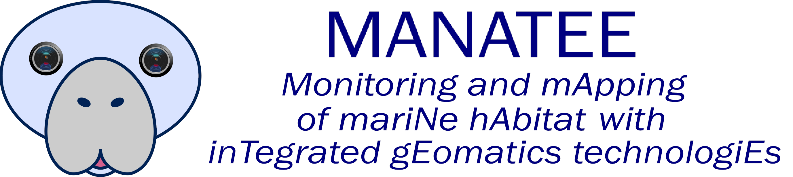

<!-- 🌊 MANATEE (Updated 06 Oct 2025) -->
# 🌊 MANATEE
**Monitoring and Mapping of Marine Habitat with Integrated Geomatics Technologies**

🌐 <a href="https://site.unibo.it/prin-manatee/en/project" target="_blank" rel="noopener">Visit the Project Website</a>

---

## Overview
**MANATEE** develops non-invasive monitoring of Mediterranean marine habitats using integrated geomatics technologies. Funded under **PRIN 2022**, the project couples underwater photogrammetry with **acoustic, pressure and inertial sensing** for precise navigation and sub-millimetre change detection on fragile bioconstructions such as the coralline red alga <i>Lithophyllum stictiforme</i>.

Our approach is implemented across three underwater platforms, designed to monitor various habitat types at different depths, scales, and resolutions:
- 🐠 **Observation UUV (Blucy-class)** — imaging payload + navigation sensors for detailed mapping at depth.
- 🤿 **Low-cost micro ROV (BlueROV2-class)** — stereo action-camera rig + USBL, optimized for 5–50 m.
- 📸 **VIP FROG / 3D Survey Device for Divers** — stereo cameras + pressure & IMU sensors with real-time quality feedback.

---

## 🌟 Key Objectives
1. **Marine Habitat Monitoring** — monitor and map habitats to assess health and evolution.  
2. **3D Modeling** — create high-resolution digital models and extract metrics to track change over time.  
3. **Sensor Integration** — combine optical, acoustic, and inertial data to improve navigation and mapping precision.  
4. **Guidelines Development** — establish procedures for protected marine areas and repeatable monitoring.

---

## 🧭 Methodology
**Multi-resolution workflow** combining:
- **Optical 3D mapping (SfM/MVS)** with calibrated scale bars and color charts for radiometric checks.  
- **Hydrostatic leveling & depth from pressure sensors** to solve scale and vertical datum.  
- **Multi-sensor navigation** (acoustic/pressure/inertial) for robust georeferencing and repeatability.  
- **Controlled, repeatable tile-mounted samples of <i>Lithophyllum stictiforme</i>** to assess sub-millimetre changes through time.  
- **Operations across depths** using divers (VIP FROG), microROV (BlueROV2-class), and UUV (Blucy-class).

---

## 🧪 Experimental Activities

### Synthetic algae sample modeling (3D-printed variants)
Starting from the photogrammetric survey of a dried thallus of <i>Lithophyllum stictiforme</i>, two slightly modified **3D-printed versions** of the same sample were modeled. Modifications were made using digital sculpting to simulate temporal growth/reduction. Both versions can be alternately fixed, using a **forced-centering procedure**, onto the same base, allowing repeat surveys with all three MANATEE platforms.

||||
|-|-|-|

📝 The scientific paper is <a href="https://isprs-archives.copernicus.org/articles/XLVIII-2-W10-2025/207/2025/" target="_blank" rel="noopener">here</a>  
⬇️ Download the full 3D models repository <a href="https://drive.google.com/drive/folders/1n3eZNBpfJSTMGImgfJD7jDQqQcGaalyA?usp=sharing" target="_blank" rel="noopener">here</a>  
📚 Documentation and blueprints are available <a href="https://drive.google.com/drive/folders/1QSufIgP7oct2hdFOlTY9_waxRuzFx1O1?usp=sharing" target="_blank" rel="noopener">here</a>

---

### Pressure measurements in controlled conditions (hydraulic tank tests)
A fundamental component of **VIP FROG** consists of custom-developed **pressure and inertial sensors**. They enhance photogrammetric surveys by resolving scale ambiguity and establishing a vertical reference, and they provide **hydrostatic leveling** measurements to define control points for detecting deformations in the photogrammetric model.

Two experimental campaigns were conducted at the **Hydraulic Engineering Laboratory – LIDR maritime tank (University of Bologna)**:
- **Static mode with controlled sea states** to verify accurate depth from pressure readings, even in wave motion.  
- **Synchronized camera–sensor surveys** under different sea conditions to provide per-image camera depth during photogrammetry.

Preliminary results confirm the potential of the method both as a supplement to photogrammetric surveys and for hydrostatic control measurements.

||||
|-|-|-|

📝 The scientific paper is <a href="https://isprs-archives.copernicus.org/articles/XLVIII-2-2024/273/2024/" target="_blank" rel="noopener">here</a>  

---

### 🗺️ Field site — Costa Paradiso (Sardinia)
The first field tests **took place in November 2024** off the coast of **Costa Paradiso (Sardinia)**. One of the live experimental areas with tile-mounted samples is located here. Explore an online 3D viewer of a representative sample:

<a href="https://geoss.altervista.org/costaparadiso/" target="_blank" rel="noopener">OPEN THE VIEWER</a>  

---

## 🗃️ Open Dataset (Zenodo)
**MANATEE — Costa Paradiso tile sample (<i>Lithophyllum stictiforme</i>):
DOI: **10.5281/zenodo.XXXXX** <!-- REPLACE with real DOI after deposit -->

---

## 🌍 Expected Impact
- 📊 **Open data** — FAIR datasets & reproducible protocols for habitat change detection.  
- 🖥️ **Virtual reality & 3D web** — immersive communication of conservation value.  
- 🛠️ **Industrial applications** — methods transferable to infrastructure inspection and environmental compliance.

---

## 👥 Project Team
- **University of Sassari**: Erica Nocerino, Alessio Calantropio, Fabio Menna  
- **University of Naples Parthenope**: Silvio Del Pizzo, Salvatore Troisi  
- **University of Bologna**: Alessandro Lambertini, Shahriar Mokhtari, Luca Vittuari  

---

## 🙏 Acknowledgments
European Union — **NextGenerationEU**, **PRIN 2022** (Project MANATEE, J53D23002570001).  
Special thanks to Prof. Cristiana Bragalli and Dr. Maria Gabriella Gaeta (Hydraulic Engineering Laboratory — LIDR, University of Bologna) and to Dr. Federico Pinna for biological samples and scientific guidance.

---

## 📜 Publications (updated 2023–2025)
- **Nocerino, E., Menna, F., Calantropio, A., …, Vittuari, L. (2025)**. *Underwater optical metrology for precision monitoring of marine habitats: the MANATEE project*. ISPRS Archives, XLVIII-2/W10-2025, 207–214. doi:10.5194/isprs-archives-XLVIII-2-W10-2025-207-2025.  
- **Calantropio, A. (2025)**. *Underwater synthetic image generation for multi-temporal monitoring*. ISPRS Archives, XLVIII-2/W10-2025, 47–54. doi:10.5194/isprs-archives-XLVIII-2-W10-2025-47-2025.  
- **Menna, F., Nocerino, E., & Calantropio, A. (2024)**. *High-accuracy height differences using a pressure sensor for GCPs in underwater photogrammetry*. ISPRS Archives, 48, 273–279.  
- **Calantropio, A., Chiabrando, F., Menna, F., & Nocerino, E. (2024)**. *Quantitative Evaluation of Color Enhancement Methods for Underwater Photogrammetry in Very Shallow Water: a Case Study*. ISPRS Annals, 10, 25–32.  
- **Del Pizzo, S., Nocerino, E., Gaglione, S., Calantropio, A., Menna, F., & Troisi, S. (2024)**. *An Action-Camera Based Stereo System for microROV for Monitoring Coralline Algae: Preliminary Assessment*. IEEE MetroSea 2024.  
- **Nocerino, E., Calantropio, A., Menna, F., Del Pizzo, S., Troisi, S., Lambertini, A., Mokhtari, S., & Vittuari, L. (2024)**. *MANATEE — un progetto per la mappatura e il monitoraggio degli habitat marini con tecnologie geomatiche integrate*. Atti ASITA 2024, 439–446.  
- **Nocerino, E., Del Pizzo, S., Lambertini, A., Troisi, S., & Vittuari, L. (2023)**. *MANATEE Project: Monitoring and Mapping of Marine Habitat with Integrated Geomatics Technologies*. IEEE MetroSea 2023, 181–186.  
- **Calantropio, A., Chiabrando, F., Menna, F., & Nocerino, E. (2024)**. *Analisi Comparativa di Metodi di Miglioramento del Colore per Fotogrammetria Subacquea in Bassa Profondità: un Caso di Studio*. Bollettino SIFET 2024. **ON PRESS**.  
- **Del Pizzo, S., Nocerino, E., Gaglione, S., Calantropio, A., Menna, F., Troisi, S. (2024)**. *An Action-Camera Based Stereo System…* IEEE MetroSea 2024. **ON PRESS** (final pagination pending).

---

## 📚 References
1. Rete Natura 2000 — <https://www.mite.gov.it/pagina/rete-natura-2000>  
2. Directive 2008/56/EC — Marine Strategy Framework Directive — <https://eur-lex.europa.eu/legal-content/IT/TXT/?uri=CELEX:32008L0056>  
3. Nocerino, E. et al., 2020. *Coral reef monitoring by scuba divers using underwater photogrammetry and geodetic surveying*. Remote Sensing.  
4. Burns, J. H. et al., 2015. *Integrating SfM photogrammetry with geospatial software…*. PeerJ.  
5. Ventura, D. et al., 2022. *Seagrass restoration monitoring…*. Journal of Environmental Management.  
6. Suka, K. et al., 2019. *Processing Photomosaic Imagery of Coral Reefs…*.  
7. Nocerino, E. et al., 2014. *Accuracy of typical photogrammetric networks…*. ISPRS Archives.  
8. Scaradozzi, D. et al., 2018. *Lab4Dive mobile smart lab…*. IOP Conf. Ser.: MSE.  
9. Yuh, J. et al., 2011. *Applications of marine robotic vehicles*. Intelligent Service Robotics.  
10. González-García, J. et al., 2020. *AUVs: localization, navigation, and communication…*. Applied Science.  
11. Shaukat, M. Z. et al., 2021. *Underwater Vehicle Positioning by Correntropy-Based Fuzzy Multi-Sensor Fusion*. Sensors.  
12. BlueROV2 Underwater ROV — <https://bluerobotics.com/store/rov/bluerov2/>  
13. Rofallski, M. et al., 2020. *Measuring Artificial Reefs using a Multi-Camera System…*. ISPRS Archives.  
14. Chemisky, R. et al., 2021. *A Portable Opto-Acoustic Survey Solution…*. ISPRS Archives.  
15. Nocerino, E. et al., 2018. *Multi-camera system calibration of a low-cost ROV for underwater cave exploration*. ISPRS Archives.  
16. UN Decade of Ocean Science — <https://www.oceandecade.org/>  
17. Abelson, A. et al., 2020. *Challenges for restoration of coastal marine ecosystems…*. Frontiers in Marine Science.  
18. Agnesi, S. et al., 2020. *Spatial Analysis of MPA Networks in Europe’s Seas III*. ETC/ICM TR 3/2020.  
19. Martin, C. et al., 2014. *Coralligenous and maërl habitats: Predictive modelling…*. Scientific Reports.  
20. Ballesteros, E., 2006. *Mediterranean coralligenous assemblages…*. Oceanography and Marine Biology.  
21. Rindi, F. et al., 2019. *Coralline algae in a changing Mediterranean Sea…*. Frontiers in Marine Science.  
22. Blanfuné, A. et al., 2018. *Sea level rise and the collapse of a Mediterranean ecosystem…*.  
23. Cornwall, C. E. et al., 2019. *Impacts of ocean warming on coralline algae…*. Frontiers in Marine Science.  
24. Torresani, M. et al., 2021. *A V-SLAM guided and portable system for photogrammetric applications*. Remote Sensing.  
25. Menna, F. et al., 2021. *Accurate Scaling and Levelling in Underwater Photogrammetry with a Pressure Sensor*. ISPRS Archives.  
26. Menna, F. et al., 2022. *Multi-Temporal Monitoring of Benthos in Antarctica…*. ISPRS Congress 2022.  
27. Lambertini, A. et al., 2022. *Underwater Drone Architecture for Marine Digital Twin: Lessons Learned from SUSHI DROP Project*. Sensors.
